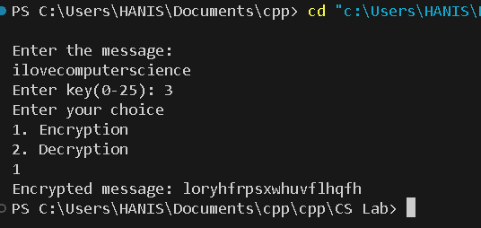
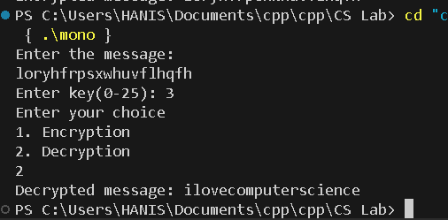
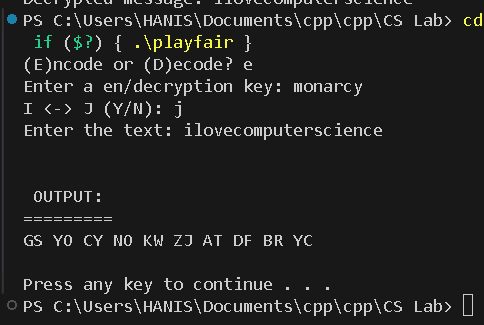
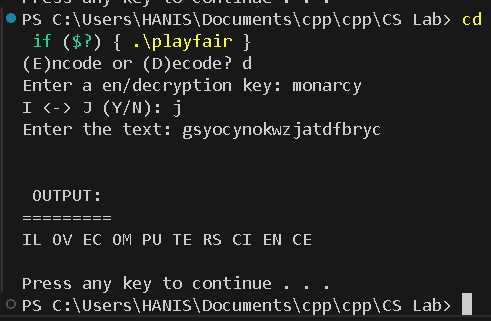
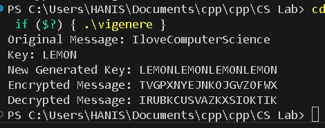

<p align="center" width="100%">
    
</p>


# TEB2093 Computer Security - Lab 03

## Members

- Ammar Farhan Bin Mohamad Rizam (22006911)
- Amisya Fareezan Binti Mohd Fadhil (22007082)
- Ahmad Anas Bin Azhar (22005996)
- Muhammad Hanis Afifi Bin Azmi (22001602)

## Task 1

### Monoalphabetic substitution cipher

**Code:**
```cpp
#include <iostream>
#include <string.h>

using namespace std;

int main() {
   cout << "Enter the message:\n";
   char msg[100];
   cin.getline(msg,100); // take the message as input
   int i, j, length, choice, key;
   cout << "Enter key(0-25): ";
   cin >> key; // take the key as input
   length = strlen(msg);
   cout << "Enter your choice \n1. Encryption \n2. Decryption \n";
   cin >> choice;
   if (choice ==1) // for encryption
   {
      char ch;
      for(int i = 0; msg[i] != '\0'; ++i) {
         ch = msg[i];
         // encrypt for lowercase letter
         if (ch >= 'a' && ch <= 'z'){
            ch = ch + key;
            if (ch > 'z') {
               ch = ch - 'z' + 'a' - 1;
            }  
            msg[i] = ch;
         }
         // encrypt for uppercase letter
         else if (ch >= 'A' && ch <= 'Z'){
            ch = ch + key;
            if (ch > 'Z'){
               ch = ch - 'Z' + 'A' - 1;
            }
            msg[i] = ch;
         }
      }
      printf("Encrypted message: %s", msg);
   }
   else if (choice == 2) { // for decryption
      char ch;
      for(int i = 0; msg[i] != '\0'; ++i) {
         ch = msg[i];
         // decrypt for lowercase letter
         if(ch >= 'a' && ch <= 'z') {
            ch = ch - key;
            if(ch < 'a'){
               ch = ch + 'z' - 'a' + 1;
            }
            msg[i] = ch;
         }
         // decrypt for uppercase letter
         else if(ch >= 'A' && ch <= 'Z') {
            ch = ch - key;
            if(ch < 'A') {
               ch = ch + 'Z' - 'A' + 1;
            }
            msg[i] = ch;
         }
      }
      cout << "Decrypted message: " << msg;
   }
}
```

**Encryption:**



**Decryption:**




## Task 2

### Playfair Cipher

**Code:**

```cpp
#include <iostream>
#include <string>
 
using namespace std;
 
class playfair
{
public:
    void doIt( string k, string t, bool ij, bool e )
    {
	createGrid( k, ij ); getTextReady( t, ij, e );
	if( e ) doIt( 1 ); else doIt( -1 );
	display();
    }
 
private:
    void doIt( int dir )
    {
	int a, b, c, d; string ntxt;
	for( string::const_iterator ti = _txt.begin(); ti != _txt.end(); ti++ )
	{
	    if( getCharPos( *ti++, a, b ) )
		if( getCharPos( *ti, c, d ) )
		{
		    if( a == c )     { ntxt += getChar( a, b + dir ); ntxt += getChar( c, d + dir ); }
		    else if( b == d ){ ntxt += getChar( a + dir, b ); ntxt += getChar( c + dir, d ); }
		    else             { ntxt += getChar( c, b ); ntxt += getChar( a, d ); }
		}
	}
	_txt = ntxt;
    }
 
    void display()
    {
	cout << "\n\n OUTPUT:\n=========" << endl;
	string::iterator si = _txt.begin(); int cnt = 0;
	while( si != _txt.end() )
	{
	    cout << *si; si++; cout << *si << " "; si++;
	    if( ++cnt >= 26 ) cout << endl, cnt = 0;
	}
	cout << endl << endl;
    }
 
    char getChar( int a, int b )
    {
	return _m[ (b + 5) % 5 ][ (a + 5) % 5 ];
    }
 
    bool getCharPos( char l, int &a, int &b )
    {
	for( int y = 0; y < 5; y++ )
	    for( int x = 0; x < 5; x++ )
		if( _m[y][x] == l )
		{ a = x; b = y; return true; }
 
	return false;
    }
 
    void getTextReady( string t, bool ij, bool e )
    {
	for( string::iterator si = t.begin(); si != t.end(); si++ )
	{
	    *si = toupper( *si ); if( *si < 65 || *si > 90 ) continue;
	    if( *si == 'J' && ij ) *si = 'I';
	    else if( *si == 'Q' && !ij ) continue;
	    _txt += *si;
	}
	if( e )
	{
	    string ntxt = ""; size_t len = _txt.length();
	    for( size_t x = 0; x < len; x += 2 )
	    {
		ntxt += _txt[x];
		if( x + 1 < len )
		{
		    if( _txt[x] == _txt[x + 1] ) ntxt += 'X';
		    ntxt += _txt[x + 1];
		}
	    }
	    _txt = ntxt;
	}
	if( _txt.length() & 1 ) _txt += 'X';
    }
 
    void createGrid( string k, bool ij )
    {
	if( k.length() < 1 ) k = "MONARCHY"; 
	k += "ABCDEFGHIJKLMNOPQRSTUVWXYZ"; string nk = "";
	for( string::iterator si = k.begin(); si != k.end(); si++ )
	{
	    *si = toupper( *si ); if( *si < 65 || *si > 90 ) continue;
	    if( ( *si == 'J' && ij ) || ( *si == 'Q' && !ij ) )continue;
	    if( nk.find( *si ) == -1 ) nk += *si;
	}
	copy( nk.begin(), nk.end(), &_m[0][0] );
    }
 
    string _txt; char _m[5][5];
};
 
int main( int argc, char* argv[] )
{
    string key, i, txt; bool ij, e;
    cout << "(E)ncode or (D)ecode? "; getline( cin, i ); e = ( i[0] == 'e' || i[0] == 'E' );
    cout << "Enter a en/decryption key: "; getline( cin, key ); 
    cout << "I <-> J (Y/N): "; getline( cin, i ); ij = ( i[0] == 'y' || i[0] == 'Y' );
    cout << "Enter the text: "; getline( cin, txt ); 
    playfair pf; pf.doIt( key, txt, ij, e ); return system( "pause" );
}
```

**Encryption:**



**Decryption:**



## Task 3

### Vigenere Cipher

**Code:**

```cpp
#include <iostream>
#include <string.h>
 
using namespace std;
 
int main(){
    char msg[] = "IloveComputerScience";
    char key[] = "LEMON";
    int msgLen = strlen(msg), keyLen = strlen(key), i, j;
 
    char newKey[msgLen], encryptedMsg[msgLen], decryptedMsg[msgLen];
 
    // generating new key
    for(i = 0, j = 0; i < msgLen; ++i, ++j){
        if(j == keyLen)
            j = 0;
 
        newKey[i] = key[j];
    }
 
    newKey[i] = '\0';
 
    // encryption
    for(i = 0; i < msgLen; ++i)
        encryptedMsg[i] = ((msg[i] + newKey[i]) % 26) + 'A';
 
    encryptedMsg[i] = '\0';
 
    // decryption
    for(i = 0; i < msgLen; ++i)
        decryptedMsg[i] = (((encryptedMsg[i] - newKey[i]) + 26) % 26) + 'A';
 
    decryptedMsg[i] = '\0';
 
    cout << "Original Message: " << msg;
    cout << "\nKey: " << key;
    cout << "\nNew Generated Key: " << newKey;
    cout << "\nEncrypted Message: " << encryptedMsg;
    cout << "\nDecrypted Message: " << decryptedMsg;
 
	return 0;
}
```

**Encryption:**



## Task 4

### Rail Fence Cipher

**Code:**

```cpp
#include <bits/stdc++.h>

using namespace std;

int main(){
    int t, n, m, i, j, k, sum=0;
    string s;
    cout << "Enter the message" << '\n';
    cin >> s;
    cout << "Enter key" << '\n';
    cin >> n;
    vector<vector<char>> a(n,vector<char>(s.size(),' '));
    j = 0;
    int flag = 0;
    for(i = 0; i < s.size(); i++){
        a[j][i] = s[i];
         if(j == n - 1){
            flag = 1;
        }
        else if(j == 0)
            flag = 0;

        if(flag == 0){
            j++;
        }
        else j--;
    }
    for(i = 0; i < n; i++){
        for(j = 0; j < s.size(); j++){
            if(a[i][j] != ' ')
                cout << a[i][j];
        }
    }
    cout << '\n';   
    return 0;
}
```

**Encryption:**


